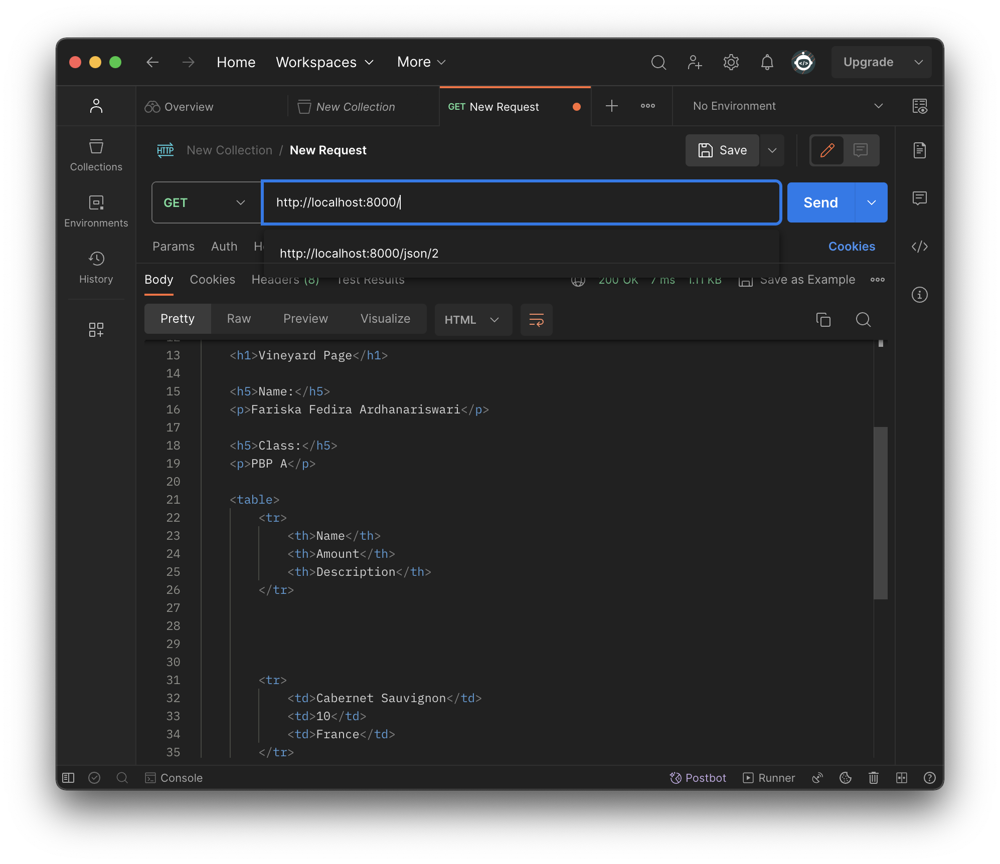

# Vineyard🍷

Nama    : Fariska Fedira Ardhanariswari

NPM     : 2206815705

Kelas   : PBP A

<details>
<summary><b> Tugas 2 <b></summary>

### Membuat sebuah proyek Django baru.
   - Membuat direktori sebagai tempat menyimpan proyek Git dan membuat repositori baru untuk mengelola proyek sesuai ketentuan dan diberi nama sesuai keinginan.
   - Menghubungkan repositori lokal dengan repositori pada GitHub.
   - Membuat virtual environment dengan menjalankan perintah "python -m venv env" pada terminal.
   - Aktifkan virtual environment dengan menjalankan perintah "source env/bin/activate", virtual environment digunakan untuk mengisolasi package serta dependencies dari aplikasi sehingga tidak bertabrakan dengan versi lain yang ada pada komputer. Aktifnya virtual environment ditandai dengan "(env)" di barus input pada terminal.
   - Menyiapkan dependencies sesuai ketentuan dengan nama file requirement.txt. Dependencies adalah komponen/modul yang dibutuhkan oleh suatu perangkat lunak untuk bekerja.
   - Pasang dependencies dengan menjalankan perintah "pip install -r requirements.txt"
   - Membuat proyek Django dengan nama "vineyard" dengan menjalankan perintah "django-admin startproject vineyard ."
   - Mengonfigurasi proyek dan menjalankan server dengan menambahkan "*" pada ALLOWED_HOSTS di settings.py untuk memberi akses pada semua host.
   - Memastikan berkas manage.py aktif dengan menjalankan server Django dengan perintah "python manage.py runserver" kemudian cek pada peramban web "http://localhost:8000" untuk mengetahui aplikasi yang dibuat berhasil.

### Membuat aplikasi dengan nama main pada proyek tersebut.
   - Aktifkan virtual environment yang telah dibuat sesuai perintah di atas.
   - Buat aplikasi baru bernama main dengan menjalankan perintah "python manage.py startapp main" untuk memberi struktur awal dan aplikasi tersebut.

### Melakukan routing pada proyek agar dapat menjalankan aplikasi main.
   - Daftarkan aplikasi main tersebut ke dalam proyek dengan menambahkan "main" pada variabel INSTALLED-APPS di berkas settings.py

### Membuat model pada aplikasi main dengan nama Item dan memiliki atribut wajib sebagai berikut.
   - Mengubah berkas models.py untuk mendefinisikan model yang baru.
   - Impor modul models dari django.db sebagai modul untuk membantu mendefinisikan model basis data untuk aplikasi.
   - Sertakan class Product (models.Model) sebagai kelas dasar untuk mendefinisikan model dalam Django.
   - Isi berkas models.py dengan atribut dan definisikan dengan tipe data yang sesuai seperti name dengan tipe CharField, amount dengan tipe IntegerField, dan description dengan tipe TextField.
   - Lakukan migrasi model untuk melihat perubahan pada model basis data yang didefinisikan. Buat migrasi model dengan menjalankan perintah "python manage.py makemigrations".
   - Aplikasikan perubahan model dengan perintah "python manage.py migrate".

###  Membuat sebuah fungsi pada views.py untuk dikembalikan ke dalam sebuah template HTML yang menampilkan nama aplikasi serta nama dan kelas kamu.
   - Impor render dari django.shortcuts untuk me-render tampilan HTML sesuai dengan data yang diberikan.
   - Membuat fungsi show_main dengan parameter request untuk mengatur permintaan HTTP dan mengembalikan tampilan yang sesuai.
   - Melengkapi "context" pada fungsi show_main yaitu dictionary yang berisi data untuk ditampilkan.
   - Fungsi show_main menggunakan return render(request, "main.html", context) untuk me-render tampilan main.html dengan menggunakan fungsi render.

### Membuat sebuah routing pada urls.py aplikasi main untuk memetakan fungsi yang telah dibuat pada views.py.
   - Melakukan routing pada proyek agar aplikasi main dapat diakses melalui peramban web.
   - Membuat berkas urls.py di dalam direktiri main untuk mengatur rute URL yang terkait dengan aplikasi main.
   - Melakukan impor path dari django.urls untuk mendefinisikan pola URL dan menggunakan fungsi show_main dari modul main.views sebagai tampilan ketika URL diakses.
   - Mengonfigurasi routing URL proyek dengan mengimpor fungsi include dari django.urls untuk mengimpor rute URL dari aplikasi main ke dalam berkas urls.py.
   - Tambahkan path URL "main/" untuk mengarahkan rute pada aplikasi main.

### Melakukan deployment ke Adaptable terhadap aplikasi yang sudah dibuat sehingga nantinya dapat diakses oleh teman-temanmu melalui Internet.
   - Login Adaptable dengan menggunakan akun GitHub.
   - Sambungkan GitHub dengan repositori yang ingin di-deploy.
   - Tekan tombol New App -> Connect an Existing Repository -> pilih proyek "Vineyard" sebagai basis aplikasi yang ingin di-deploy.
   - Pilih Python App Template sebagai template deployment dan PostgreSQL sebagai tipe basis data yang akan digunakan.
   - Sesuaikan versi Python yang digunakan.
   - Untuk bagian Start Command isi dengan perintah "python manage.py migrate && gunicorn vineyard.wsgi".
   - Isi nama aplikasi dengan "vineyard".
   - Centang bagian HTTP Listener on PORT lalu klik Deploy App.

### Buatlah bagan yang berisi request client ke web aplikasi berbasis Django beserta responnya dan jelaskan pada bagan tersebut kaitan antara urls.py, views.py, models.py, dan berkas html.
   - User mengirimkan request ke URL, kemudian berkas urls.py akan mencocokan permintaan user dengan pola URL yang sesuai dan mengarahkan ke views sesuai berkas views.py. Views akan menggunakan Model dalam berkas models.py untuk mengakses data yang diperlukan. Views akan me-render halaman HTML dengan template yang sesuai kemudian menggabungkan dengan data dari model ke halaman web. Halaman web akan dikirim kembali sebagai respon kepada user.

   
   
### Jelaskan mengapa kita menggunakan virtual environment? Apakah kita tetap dapat membuat aplikasi web berbasis Django tanpa menggunakan virtual environment?
- Kita tetap dapat membuat aplikasi web berbasis Django tanpa menggunakan virtual environment, tetapi tidak disarankan. Jika tidak menggunakan virtual environment terdapat risiko konflik dependencies. Virtual environment berguna untuk mengisolasi package serta dependencies dari aplikasi sehingga tidak bertabrakan dengan versi lain pada perangkat user.

### Jelaskan apakah itu MVC, MVT, MVVM dan perbedaan dari ketiganya.
   - MVC : Model View Controller
        - Model : Tempat menyimpan data dan informasi aplikasi.
        - View : Tampilan, menunjukkan informasi kepada pengguna. Seperti halaman web pengguna aplikasi.
        - Controller : Mengatur bagaimana permintaan pengguna ditangani. Penghubung antara View dan Model.
        Perbedaan : Cara mengorganisir kode dalam aplikasi agar mudah dimengerti, biasa digunakan dalam aplikasi berbasis desktop dan web.
   - MVT : Model View Template
        - Model : Tempat menyimpan data dan informasi aplikasi seperti pada MVC.
        - View : Tampilan yang menampilkan informasi kepada pengguna.
        - Template : Mengatur tampilan halaman web dan menentukan bagaimana data dari Model akan ditampilkan.
        Perbedaan : Varian dari MVC yang digunakan dalam kerangka Django, Template mengatur tampilan dalam halaman web dan menggabungkan dengan data dari Model.
   - MVVM : Model View ViewModel
        - Model : Tempat menyimpan data dan informasi aplikasi.
        - View : Tampilan yang menampilkan informasi kepada pengguna.
        - ViewModel : Penghubung antara Model dan View, mengelola tampilan data dari Model, dan menyediakan cara untuk berinteraksi dengan data tersebut.
        Perbedaan : ViewModel memisahkan cara data ditampilan dari data itu sendiri.
</details>

<details>
<summary><b> Tugas 3 <b></summary>

### Membuat input form untuk menambahkan objek model pada app sebelumnya.
   - Membuat sebuah berkas dengan nama `forms.py` untuk membuat struktur form sebagai input data produk baru pada aplikasi.
   - Lakukan impor ModelForm dari modul forms pada Django, ini digunakan untuk mempermudah proses pembuatan form untuk interaksi dengan data dalam Product.
   - Impor Product dari modul main.models, ini menunjukkan Product digunakan dalam form yang akan dibuat.
   - Definisikan kelas ProductForm yang merupakan turunan dari ModelForm.
   - Buat nested class, class Meta, untuk menentukan atribut yang akan digunakan.
   - Hubungkan form ProductForm dengan model Product, dengan menambahkan `model = Product`, form akan menggunakan definisi model Product sebagai dasar untuk membuat input fields.
   - Tambahkan `fields = ["name", "amount", "description"]`. Fields digunakan untuk menentukan kolom dari form yang akan berisi field `nama`, `amount`, dan `description`.
   
### Tambahkan 5 fungsi views untuk melihat objek yang sudah ditambahkan dalam format HTML, XML, JSON, XML by ID, dan JSON by ID.
   - Format HTML
      - Pada berkas views.py tambahkan beberapa impor berikut:
         - from django.http import HttpResponseRedirect
         - from main.forms import ProductForm
         - from django.urls import reverse
      - Buat fungsi `create_product` dengan parameter `request`, yaitu permintaan HTTP yang dikirim user ke server.
      - Tambahkan `form = ProductForm(request.POST or None)` untuk membuat ProductForm baru dengan memasukkan QueryDict berdasarkan input user pada request.POST.
      - `if form.is_valid() and request.method == "POST":`, digunakan untuk memvalidasi isi input form dan *request* dikirimkan menggunakan metode POST.
      - `form.save()` digunakan untuk membuat dan menyimpan data dari form tersebut.
      - `return HttpResponseRedirect(reverse('main:show_main'))` untuk melakukan *redirect* setelah data form berhasil disimpan.
      - `context = {'form': form}` dijalankan apabila input form tidak valid atau *request* tidak menggunakan POST, maka objek 'form' akan disertakan dalam 'context'.
      - `return render(request, "create_product.html", context)`, me-*render* halaman HTML.
      - Tambahkan `Product.abjects.all()` pada fungsi show_main pada berkas 'views.py' untuk mengambil seluruh object Product yang tersimpan pada *database*.
      - Impor fungsi `create_product` pada berkas 'urls.py'.
      - Tambahkan *path url* `path('create-product', create_product, name='create_product'),` untuk mengakses fungsi yang sudah diimpor sebelumnya.
      - Buat berkas HTML dengan nama `create_product.html` pada direktori `main/templates`.
      - Pada berkas tersebut isi dengan ``, untuk mengindikasikan template ini meng-*extend* dari `base.html`.
      - `<form method="POST">` untuk menunjukkan data dari form dikirim dengan metode POST.
      - `` token di-*generate* secara otomatis dari Django yang berfungsi sebagai *security*.
      - `{{ form.as_table }}` untuk menampilakan *fields* form yang sudah dibuat sebagai *table*.
      - `<input type="submit" value="Add Product"/`' sebagai tombol *submit* untuk mengirimkan *request* ke *view*.
      - Pada main.html tambahkan komponen-komponen lain yang ingin ditambahkan dan sertakan tombol `Add New product` yang akan *redirect* ke halaman form.

   - Format XML
      - Pada berkas views.py, impor HttpResponse dan Serializer.
      - Buat sebuah fungsi `show_xml` dengan parameter *request*.
      - Simpan `data = Product.objects.all()` pada sebuah variabel sebagai tempat menyimpan hasil *query* dari data yang ada pada `Product`.
      - Tambahkan `return HttpResponse(serializers.serialize("xml", data), content_type="application/xml")` sebagai *return function* berupa `HttpResponse` dengan parameter data hasil *query* yang sudah diserialisasi menjadi XML.
      - Impor fungsi `show_xml` pada berkas `urls.py`.
       - Tambahkan *path url* `path('xml/', show_xml, name='show_xml'),` untuk mengakses fungsi yang sudah diimpor sebelumnya.

   - Format JSON
      - Lakukan hal yang sama seperti pada format xml, namun diubah dengan json.
      - Buat fungsi `show_json` yang diisi dengan `data = Product.objects.all()` lalu me-*return* `return HttpResponse(serializers.serialize("json", data), content_type="application/json")`
      - Impor fungsi `show_json` pada berkas `urls.py`.
       - Tambahkan *path url* `path('json/', show_json, name='show_json'),` untuk mengakses fungsi yang sudah diimpor sebelumnya.

   - Format XML by ID
      - Lakukan hal yang sama seperti pada format xml, namun ubah variabel data dengan `data = Product.objects.filter(pk=id)` untuk memberi filter menggunakan ID.
      - Buat fungsi `show_xml_by_id` yang diisi dengan `data = Product.objects.filter(pk=id)` lalu me-*return* `return HttpResponse(serializers.serialize("xml", data), content_type="application/xml")`
      - Impor fungsi `show_xml_by_id` pada berkas `urls.py`.
       - Tambahkan *path url* `path('xml/<int:id>/, show_xml_by_id, name='show_xml_by_id'),` untuk mengakses fungsi yang sudah diimpor sebelumnya.
      
   - Format XML by ID
      - Lakukan hal yang sama seperti pada format xml, namun diubah dengan json.
      - Buat fungsi `show_json_by_id` yang diisi dengan `data = Product.objects.filter(pk=id)` lalu me-*return* `return HttpResponse(serializers.serialize("json", data), content_type="application/json")`
      - Impor fungsi `show_json_by_id` pada berkas `urls.py`.
      - Tambahkan *path url* `path('json/<int:id>/', show_json_by_id, name='show_json_by_id'),` untuk mengakses fungsi yang sudah diimpor sebelumnya.

### Membuat routing URL untuk masing-masing views yang telah ditambahkan pada poin 2.
   - Untuk setiap fungsi format pada poin 2, impor fungsi pada berkas 'urls.py', kemudian tambahkan *path url* dengan format dibawah ini:
      ```python
         'path('xml/', show_xml, name='show_xml'),'
         'path('json/', show_json, name='show_json'),'
         'path('xml/<int:id>/', show_xml_by_id, name='show_xml_by_id'),'
         'path('json/<int:id>/', show_json_by_id, name='show_json_by_id')'
      ```

### Apa perbedaan antara form POST dan form GET dalam Django?
   - POST
      - Method POST akan mnegirim data/nilai langsung ke action untuk disimpan, tanpa menampilkannya pada url.
      - Data yang dikirim tidak memiliki batas.

   - GET
      - Method GET akan menampilkan data/nilai pada url, kemudian ditampung oleh action.
      - Data tidak boleh lebih dari 2047 karakter.

### Apa perbedaan utama antara XML, JSON, dan HTML dalam konteks pengiriman data?
   - XML
      - Digunakan untuk menyimpan dan mengirim data terstruktur, seperti konfigurasi dan pertukaran data antar aplikasi.
      - Memiliki struktur yang fleksibel dan dapat mendefinisikan tipe data yang kompleks, menggunakan tag.
      - Memiliki ukuran file yang lebih besar karena *markup* lebih banyak.

   - JSON
      - Digunakan untuk pertukaran data antara aplikasi web dan server.
      - Terdiri dari pasangan key-value dalam format objek dan array.
      - Ukuran file lebih kecil karena formatnya ringkas.
   
   - HTML
      - Digunakan untuk membuat halaman web dan menampilkan konten di browser web.
      - Digunakan untuk mengatur tampilan dan konten halaman web, presentasi dan interaksi pengguna.
      - Ukuran file tergantung kompleksitas halaman web.

### Mengapa JSON sering digunakan dalam pertukaran data antara aplikasi web modern?
   - Format JSON ringkas dan mudah dibaca.
   - Ukuran file JSON kecil, mengurangi beban jaringan.
   - JSON didukung dengan banyak bahasa pemrograman, sehingga mudah digunakan diberbagai platform.
   - Struktur data yang terurut, dapat menggambarkan data kompleks dengan objek dan array.
   - Didukung oleh browser web modern melalui JavaScript. 

### Mengakses kelima URL di poin 2 menggunakan Postman, membuat screenshot dari hasil akses URL pada Postman, dan menambahkannya ke dalam README.md.

1. HTML
   

2. XML
   

3. JSON
   

4. XML BY ID
   
   
5. JSON BY ID
   
</details>

<details>
<summary><b> Tugas 4 <b></summary>

### Mengimplementasikan fungsi registrasi, login, dan logout untuk memungkinkan pengguna untuk mengakses aplikasi sebelumnya dengan lancar.

#### Registrasi
   - Tambahkan import `redirect`, `UserCreationForm`, `messages` pada berkas `views.py`.
      ```python
      from django.shortcuts import redirect
      from django.contrib.auth.forms import UserCreationForm
      from django.contrib import messages
      ```
      `UserCreationForm` adalah formulir bawaan yang dapat digunakan untuk memudahkan pembuatan formulir pendaftaran pengguna dalam aplikasi web.
   - Buat fungsi `register` dengan parameter `request` kemudian isi dengan potongan kode berikut.
      ```python
      def register(request):
         form = UserCreationForm()

         if request.method == "POST":
            form = UserCreationForm(request.POST)
            if form.is_valid():
                  form.save()
                  messages.success(request, 'Your account has been successfully created!')
                  return redirect('main:login')
         context = {'form':form}
         return render(request, 'register.html', context)
      ```
      Kode tersebut berfungsi untuk membuat formulir registrasi dan akun pengguna secara otomatis ketika data di-*submit*.
      - `form = UserCreationForm(request.POST)` digunakan untuk membuat *instance* baru dari `UserCreationForm` dengan menggunakan *input* dari pengguna pada `request.POST`.
      - `form.is_valid()` digunakan untuk memeriksa apakah isi *input* dari *form* tersebut valid.
      - Jika valid, `form.save()` digunakan untuk menyimpan data dari *form*.
      - Jika berhasil, pesan sukses akan ditampilkan kepada pengguna dengan `messages.success(request, 'Your account has been successfully created!')`.
      - `return redirect('main:show_main')` digunakan untuk kembali ke halaman utama setelah *form* berhasil disimpan.
   - Buat berkas HTML dengan nama `register.html` pada folder `main/templates` kemudian isi dengan kode berikut.
      ```python
      

      
         <title>Register</title>
      

        

      <div class = "login">
         
         <h1>Register</h1>  

            <form method="POST" >  
                    
                  <table>  
                     {{ form.as_table }}  
                     <tr>  
                        <td></td>
                        <td><input type="submit" name="submit" value="Daftar"/></td>  
                     </tr>  
                  </table>  
            </form>

           
            <ul>   
                    
                     <li>{{ message }}</li>  
                       
            </ul>   
         

      </div>  

      
      ```
   - Impor fungsi `register` pada berkas `urls.py` pada subdirektori `main` kemudian tambahkan *path url* ke dalam `urlpatterns`.
      ```python
      ...
      path('register/', register, name='register'),
      ```

#### Login
   - Pada berkas `views.py` dalam subdirektori `main` tambahkan impor `authenticate` dan `login`.
      ```python
      from django.contrib.auth import authenticate, login
      ```
      *Function* ini digunakan untuk melakukan autentikasi dan *login* jika autentikasi berhasil.
   - Buat fungsi `login` dengan parameter `request` untuk mengauntektikasi pengguna yang ingin *login*.
      ```python
      def login_user(request):
         if request.method == 'POST':
            username = request.POST.get('username')
            password = request.POST.get('password')
            user = authenticate(request, username=username, password=password)
            if user is not None:
                  login(request, user)
                  return redirect('main:show_main')
            else:
                  messages.info(request, 'Sorry, incorrect username or password. Please try again.')
         context = {}
         return render(request, 'login.html', context)
      ```
      - `authenticate(request, username=username, password=password)` berfungsi untuk melakukan autentikasi pengguna yang ingin *login* berdasarkan username dan password dari request.
   - Buat berkas HTML dengan nama `login.html` pada folder `main/templates` dengan isi kode berikut.
      ```python
      

      
         <title>Login</title>
      

      

      <div class = "login">

         <h1>Login</h1>

         <form method="POST" action="">
            
            <table>
                  <tr>
                     <td>Username: </td>
                     <td><input type="text" name="username" placeholder="Username" class="form-control"></td>
                  </tr>
                        
                  <tr>
                     <td>Password: </td>
                     <td><input type="password" name="password" placeholder="Password" class="form-control"></td>
                  </tr>

                  <tr>
                     <td></td>
                     <td><input class="btn login_btn" type="submit" value="Login"></td>
                  </tr>
            </table>
         </form>

         
            <ul>
                  
                     <li>{{ message }}</li>
                  
            </ul>
              
            
         Don't have an account yet? <a href="">Register Now</a>

      </div>

      
      ```
   - Impor fungsi `login_user` pada berkas `urls.py` kemudian tambahkan *path url* ke dalam `urlpatterns`.
      ```python
      ...
      path('login/', login_user, name='login'),
      ...
      ```

#### Logout
   - Buka `views.py` kemudian tambahkan impor `logout`.
   - Buat fungsi dengan nama `logout_user` dengan parameter `request` untuk melakukan mekanisme logout.
      ```python
      def logout_user(request):
         logout(request)
         return redirect('main:login')
      ```
      - `logout(request)` berfungsi untuk menghapus sesi pengguna yang saat ini masuk.
      - `return redirect('main:login')` digunakan untuk *redirect*/mengarahkan pengguna ke halaman *login*.
   - Tambahkan kode berikut untuk *logout* pada berkas `main.html`.
      ```python
      ...
      <a href="">
         <button>
            Logout
         </button>
      </a>
      ...
      ```
   - Impor fungsi `logout_user` pada berkas `urls.py` kemudian tambahkan *path url* ke dalam `urlpatterns`.
      ```python
      ...
      path('logout/', logout_user, name='logout'),
      ...
      ```
### Menghubungkan model `Item` dengan `User`.
   Step ini dilakukan agar setiap pengguna yang sedang terotorisasi hanya melihat produk-produk yang telah dibuatnya sendiri.
   - Pada berkas `models.py` yang ada di subdirektori `main` impor User.
      ```python
      ...
      from django.contrib.auth.models import User
      ...
      ```
   - Pada model `Product`, tambahkan potongan kode berikut.
      ```python
      class Product(models.Model):
      user = models.ForeignKey(User, on_delete=models.CASCADE)
      ...
      ```
      Kode diatas berfungsi untuk mengaitkan satu produk dengan satu pengguna melalui sebuah *relationship*, yang berarti setiap produk pasti terhubung dengan satu pengguna.
   - Ubah potongan kode pada fungsi `create_product` yang ada di berkas `views.py` sebagai berikut.
      ```python
      def create_product(request):
         form = ProductForm(request.POST or None)

         if form.is_valid() and request.method == "POST":
            product = form.save(commit=False)
            product.user = request.user
            product.save()
            return HttpResponseRedirect(reverse('main:show_main'))
         ...
      ```
      - Penggunaan parameter `commit=False` berguna untuk menghindari Django agar tidak secara otomatis menyimpan objek yang dibuat dari formulir ke dalam *database*, sehingga objek tersebut dapat dimodifikasi terlebih dahulu sebelum disimpan. 
      - Mengisi field `user` dengan objek `User` dari *return value* `request.user` yang sedang terotorisasi untuk menunjukkan objek tersebut milih pengguna yang sedang login.
   - Ubah fungsi `show_main`.
      ```python
      def show_main(request):
         products = Product.objects.filter(user=request.user)

         context = {
            'name': request.user.username,
         ...
      ...
      ```
      - Kode tersebut bertujuan untuk menampilkan objek `Product` yang terhubung dengan pengguna yang sedang *login*. Ini dilakukan dengan melakukan filter pada seluruh objek dengan hanya mengambil `Product` yang memiliki pengguna yang sama dengan pengguna yang sedang masuk.
      - `request.user.username` berfungsi untuk menampilkan *username* pengguna yang sedang *login* pada halaman *main*.
   - Simpan perubahan pada model dengan melakukan migrasi model dengan `python manage.py makemigrations`.
   - Saat muncul error pilih 1 untuk menetapkan default value untuk field user pada semua row yang telah dibuat, kemudian pilih 1 lagi untuk menetapkan user dengan ID 1.
   - Jalankan `python manage.py migrate` untuk mengaplikasikan migrasi.

### Menampilkan detail informasi pengguna yang sedang logged in seperti username dan menerapkan `cookies` seperti `last login` pada halaman utama aplikasi.
   - Impor `HttpResponseRedirect`, `reverse`, dan `datetime` pada berkas `views.py` pada subdirektori `main`.
      ```python
      import datetime
      from django.http import HttpResponseRedirect
      from django.urls import reverse
      ```
   - Pada fungsi `login_user` tambahkan fungsi `last_login` untuk menambahkan *cookie* agar dapat melihat kapan terakhir kali pengguna melakukan *login*. Lakukan dengan mengubah kode berikut.
      ```python
      ...
      if user is not None:
         login(request, user)
         response = HttpResponseRedirect(reverse("main:show_main")) 
         response.set_cookie('last_login', str(datetime.datetime.now()))
         return response
      ...
      ```
      - `login(request, user)` berfungsi untuk melakukan login pengguna.
      - `response = HttpResponseRedirect(reverse("main:show_main"))` untuk membuat *response* yang akan mengarahkan pengguna ke halaman *main*.
      - `response.setcookie('last_login', str(datetime.datetime.now()))` berfungsi untuk membuat dan menyimpan *cookie* dengan nama `last_login` yang berisi informasi kapan terakhir *login* dan menambahkannya ke dalam *response*.
      - Tambahkan `'last_login': request.COOKIES['last_login'],` ke dalam variabel `context` yang ada pada fungsi `main`. Ini berfungsi untuk menambahkan informasi `cookie last_login` pada *response* yang ditampilkan di web.
      - Ubah fungsi `logout` dengan kode berikut.
         ```python
         def logout_user(request):
            logout(request)
            response = HttpResponseRedirect(reverse('main:login'))
            response.delete_cookie('last_login')
            return response
         ```
         - `response.delete_cookie('last_login')` berfungsi untuk menghapus *cookie* `last_login` saat pengguna melakukan *logout* akun.
      - Tambahkan kode berikut pada `main.html` untuk menampilkan data *last login*.

### Apa itu Django `UserCreationForm`, dan jelaskan apa kelebihan dan kekurangannya?
   - `UserCreationForm` adalah formulir bawaan yang dapat digunakan untuk memudahkan pembuatan formulir pendaftaran pengguna dalam aplikasi web. Dengan formulir ini, pengguna baru dapat membuat akun baru dengan mengisi informasi seperti nama, kata sandi, dan data lainnya dengan mudah di situs web tanpa harus menulis kode dari awal.
   - Kelebihan:
      - Mudah digunakan: disediakan olehh Django sebagai kerangka kerja agar tidak harus membuat kode *form* pendaftaran dari awal.
      - Validasi bawaan: *Form* ini dilengkapi dengan fitur validasi yang membantu memastikan data yang dimasukkan pengguna sesuai dengan peraturan yang ditentukan.
      - Integrasi dengan Django Authentication: *Form* ini terintegrasi dengan sistem autentikasi Django sehingga memudahkan dalam mengelola autentikasi pengguna pada aplikasi.
   - Kekurangan:
      - Keterbatasan desain: Hanya menyediakan desain yang sederhana yang mungkin tidak memenuhi kebutuhan desain UI yang lebih kompleks.
      - Penanganan kesalahan tambahan: Meskipun sudah terdapat validasi bawaan, masih perlu penambahan penanganan kesalahan yang sesuai jika pengguna gagal daftar.
      - Tidak mendukung pendaftaran sosial media: Dirancang hanya untuk pendaftaran dengan *username* dan kata sandi, perlu menambahkan integrasi tambahan untuk *login* melalui media sosial lain.

### Apa perbedaan antara autentikasi dan otorisasi dalam konteks Django, dan mengapa keduanya penting?
   - Autentikasi adalah proses memverifikasi identitas pengguna, memastikan bahwa pengguna yang berusaha masuk (*login*) adalah orang yang sebenarnya.
   - Otorisasi adalah proses yang menentukan apa saja hal yang dapat diakses oleh pengguna setelah mereka berhasil diautentikasi.
   - Keduanya menjadi penting karena autentikasi memastikan bahwa hanya pengguna yang diizinkan yang dapat masuk ke dalam aplikasi. Sedangkan Otorisasi memastikan pengguna hanya memiliki akses ke fitur/data yang diizinkan. Hal ini membantu melindungi data dan mencegah pengguna yang tidak diizinkan untuk melakukan tindakan yang tidak seharusnya.

### Apa itu cookies dalam konteks aplikasi web, dan bagaimana Django menggunakan cookies untuk mengelola data sesi pengguna?
   - Cookies adalah bagian data yang disimpan di sisi *client* oleh server web. Cookies digunakan untuk menyimpan informasi yang dapat digunakan untuk mengidentifikasi dan melacak pengguna saat mereka berinteraksi dengan situs web.
   - Django memerlukan proses yang disebut *holding state* agar saat pengguna pindah halaman dari halaman A ke halaman B pada web yang sama, ia tidak diminta untuk melakukan login kembali. Untuk melakukan *holding state* diperlukan sebuah teknik, yaitu *cookie* dan *session*. Cara melakukan *holding state* yaitu dengan menggunakan *session ID* yang disimpan sebagai *cookie* pada komputer *client*. *Session ID* adalah token untuk mengenali *session* yang unik pada web. Session ID kemudian akan dipetakan ke suatu struktur data pada sisi web server. Cookie memiliki kapasitas maksimal 4 KB dan memiliki waktu hidup yang dapat dikonfigurasi, tidak seperti sesi yang memiliki waktu hidup lebih singkat yaitu sampai pengguna keluar/sesi berakhir.

### Apakah penggunaan cookies aman secara default dalam pengembangan web, atau apakah ada risiko potensial yang harus diwaspadai?
   - Pada penggunaan cookies dalam pengembangan web, tetap ada risiko potensial yang harus diwaspadai seperti pencurian data pengguna. Jika sebuah data penting seperti kata sandi atau informasi keuangan disimpan dalam cookies tanpa enkripsi yang memadai, akan menjadi target pencurian data oleh pihak yang tidak bertanggung jawab. Selain itu, ada juga yang disebut dengan serangan CSRF, yaitu jenis serangan keamanan siber berupa penipuan atau pemalsuan permintaan ke sebuah website melalui website yang sedang pengguna digunakan secara tidak sadar. Serangan ini memanfaatkan pengguna yang sudah login ke suatu situs dan masih memiliki sesi atau kredensial otentifikasi yang masih berlaku.
</details>

<details>
<summary><b> Tugas 5 <b></summary>

### Jelaskan manfaat dari setiap element selector dan kapan waktu yang tepat untuk menggunakannya.
   - Selector Universal (*)
      Untuk memilih semua elemen dalam dokumen HTML,jika ingin mengatur nilai default untuk semua elemen.
   - Selector Elemen
      Memilih elemen berdasarkan jenis elemennya (`<p>, <h1>, <div>`), Mengganti atau menyesuaikan gaya elemen secara global berdasarkan tipe elemen.
   - Selector Kelas (.nama-kelas)
      Memilih berdasarkan nama kelas yang diberikan, untuk mengganti atau menyesuaikan gaya elemen yang memiliki kelas tertentu.
   - Selector ID (#id-elemen)
      Memilih elemen berdasarkan ID uniknya, jika perlu menargetkan elemen tertentu untuk modifikasi khusus.
   - Selector Pseudo-class (:hover, :active, :focus, dll.)
      Memilih elemen berdasarkan keadaannya, untuk memberikan gaya interaktif kepada elemen saat pengguna berinteraksi dengan halaman.
   - Selector Pseudo-element (::before, ::after, ::first-line, dll.)
      Untuk menambahkan konten atau mengubah gaya elemen tertentu dalam elemen yang ada, untuk menambahkan atau mengubah tampilan elemen tertentu tanpa perlu menambahkan elemen tambahan di HTML.
   - Selector Kombinasi (potongan div p, div > p, div + p, div ~ p)
      Memilih elemen berdasarkan hubungan hierarki atau tetangga mereka.

### Jelaskan HTML5 Tag yang kamu ketahui.
   - `<!DOCTYPE html>`: tag untuk menentukan tipe dokumen.
   - `<html>`: tag untuk membuat sebuah dokumen HTML
   - `<title>`	: judul dari sebuah halaman.
   - `<body>` : tubuh dari sebuah halaman.
   - `<h1> to <h6>` : membuat heading dengan ukuran tertentu.
   - `<p>` : membuat paragraf.
   - `<br>`	: memasukan baris kosong.
   - `<hr>`	: membuat garis lurus.
   - `<!--...-->`	: tag untuk membuat komentar.
   - `<link>` : menghubungkan halaman HTML dengan berkas lain.
   - `<style>` : tempat menulis CSS untuk mengatur tampilan halaman web.
   - `<nav>` : tempat untuk tautan navigasi atau menu.
   - `<main>` : tempat untuk konten utama halaman web.
   - `<section>` :m engelompokkan konten, seperti bagian dari halaman.
   - `<a>` : tautan atau hyperlink yang mengarahkan ke halaman web lain.
   - `` : menampilkan gambar di halaman web.
   - `<ul>, <ol>, <li>` : untuk membuat daftar, seperti daftar tanpa urutan `(<ul>)`, daftar terurut `(<ol>)` : dan *item* dalam daftar `(<li>)`.
   - `<div>` : untuk mengelompokkan elemen-elemen HTML untuk pengaturan tampilan.
   - `<button>` : untuk menambahkan tombol.

###  Jelaskan perbedaan antara margin dan padding.
   - Margin
      - Margin adalah area di sekitar *border*.
      - Fungsi margin adalah untuk mengontrol jarak antara elemen dengan elemen lain di sekitarnya, sehingga mempengaruhi tata letak keseluruhan elemen.
      - Margin biasanya tidak memiliki latar belakang, warna, dan tidak mempengaruhi tampilan elemen.
      - Margin dapat digunakan untuk memberi elemen ruang di atas, bawah, kanan, atau kiri.
   - Padding
      - Padding adalah area di sekitar konten.
      - Fungsinya adalah mengatur jarak antara konten elemen dan border elemen tersebut.
      - Padding dapat memiliki warna atau latar belakang yang berbeda, sehingga memengaruhi tampilan elemen dan area di sekitarnya.
      - Padding juga mempengaruhi tampilan konten di dalam elemen, seperti teks atau gambar.

### Jelaskan perbedaan antara framework CSS Tailwind dan Bootstrap. Kapan sebaiknya kita menggunakan Bootstrap daripada Tailwind, dan sebaliknya?
| Tailwind | Bootstrap |
| ------- | ------- |
| Tailwind CSS membuat tampilan dengan menggabungkan kelas utilitas yang sudah ada sebelumnya. | Bootstrap menggunakan gaya dan komponen yang sudah ada sebelumnya, sehingga bisa langsung menggunakannya tanpa harus membuat tampilan dari awal. |
| File CSS lebih kecil dibandingkan Bootstrap dan hanya memuat kelas-kelas utilitas yang digunakan. | File Bootstrap karena termasuk banyak komponen yang telah didefinisikan sebelumnya. |
| Memberikan tingkat fleksibilitas dan adaptabilitas yang tinggi terhadap proyek. | Bootstrap menghasilkan tampilan yang konsisten di seluruh proyek karena menggunakan komponen yang sudah didefinisikan. |
| Memerlukan pembelajaran yang lebih dalam karena memerlukan pemahaman terhadap kelas-kelas utilitas yang ada dan cara menggabungkannya. |  Lebih cepat untuk dipelajari karena dapat langsung menggunakan komponen yang sudah ada tanpa perlu menggabungkan banyak kelas utilitas. |

   - Sebaiknya menggunakan Bootstrap jika ingin mengembangkan *website* dalam jangka waktu yang cepat serta memiliki tampilan yang seragam serta terstruktur. Ini dapat digunakan jika pembuat web memiliki waktu terbatas atau ingin tampilan mirip dengan tema Bootstrap yang sudah ada saja.
   - Menggunakan tailwind jika menginginkan fleksibilitas tinggi dalam merancang tampilan. Dapat digunakan jika pembuat web ingin mengatur web dengan tampilan yang unik atau berbeda antara halaman-halaman.

### Kustomisasi desain pada templat HTML yang telah dibuat pada Tugas 4 dengan menggunakan CSS atau CSS framework

#### Menambahkan Bootstrap ke aplikasi
   - Pada `templates/base.html' tambahkan kode berikut.
      ```py
      <head>
         
            ...
         
         <link href="https://cdn.jsdelivr.net/npm/bootstrap@5.3.2/dist/css/bootstrap.min.css" rel="stylesheet" integrity="sha384-T3c6CoIi6uLrA9TneNEoa7RxnatzjcDSCmG1MXxSR1GAsXEV/Dwwykc2MPK8M2HN" crossorigin="anonymous">
            <script src="https://code.jquery.com/jquery-3.6.0.min.js" integrity="sha384-KyZXEAg3QhqLMpG8r+J4jsl5c9zdLKaUk5Ae5f5b1bw6AUn5f5v8FZJoMxm6f5cH1" crossorigin="anonymous"></script>
      </head>
      ```

#### Membuat Navigation Bar
   - Membuat navigation bar dengan implementasi kode sebagai berikut.
      ```py
          <nav class="navbar navbar-expand-lg shadow" style = "background-color: #141519">
            <div class="container">
                  <span class="navbar-brand mb-0 h1;">{{name}}</span>
                  <ul class="navbar-nav ms-auto">
                     <li class="nav-item">
                        <a class="nav-link" href="">
                              <button class="btn btn-outline-secondary" style="color: #e8dcd5;" type="submit">Logout</button>
                        </a>
                     </li>
                  </ul>
            </div>
         </nav>
      ```
   
#### Membuat header
   - Membuat header web dengan menggunakan Bootstrap.
   ```py
    <div class="jumbotron">
        <div class="jumbotron-content">
            <h1 class="title">VINEYARD</h1>
            <hr class="caption">
            <p>Introduce an excellent collection of white and red wine.</p>
        </div>
    </div>
   
   ```
#### Kustomisasi halaman login, register, dan tambah inventori
   - Kustomisasi halaman daftar inventori menggunakan komponen Bootstrap yaitu Card.
   ```py
   <div class="container">
      <div class="row">
         
         <div class="col-md-6 col-lg-6 col-sm-12">
               <div class="product-card">
                  <div class="product-image">
                     
                  </div>
                  <div class="product-details">
                     <div class="product-name">{{ product.name }}</div>
                     <div class="product-description">{{ product.description }}</div>
                     <div class="product-amount">In Stock: {{ product.amount }}</div>
                  </div>
                  <div class="product-actions mt-auto">
                     <a href="">
                           <button class="product-button-dark">+</button>
                     </a>
                     <a href="">
                           <button class="product-button-dark">-</button>
                     </a>
                     <a href="">
                           <button class="product-button-dark">Edit</button>
                     </a>
                     <a href="">
                           <button class="product-button-dark">Delete Product</button>
                     </a>
                  </div>
               </div>
         </div>
         
      </div>
   </div>   
   ```
</details>

## Tugas 6

#### Jelaskan perbedaan antara *asynchronous programming* dengan *synchronous programming*.
   - *Synchronous programming*
      - Kode non-blokir, program bisa melanjutkan tugas lain tanpa menunggu.
      - Program dapat terasa lambat jika ada tugas yang memakan waktu.
      - Dalam manajemen tugas, tugas dieksekusi berdasarkan urutan.

   - *Asynchronous programming*
      - Kode bersifat bloking, program akan menunggu hasil sebelum melanjutkan.
      - Meningkatkan responsivitas aplikasi, bahkan jika ada tugas yang memakan waktu.
      - Menggunakan callback atau promise untuk mengatur tugas.

#### Dalam penerapan JavaScript dan AJAX, terdapat penerapan paradigma event-driven programming. Jelaskan maksud dari paradigma tersebut dan sebutkan salah satu contoh penerapannya pada tugas ini.
   - Paradigma event-driven programming adalah cara pemrograman di mana program merespons peristiwa yang terjadi, seperti klik tombol atau respons dari server. 
   - Contohnya dalam tugas ini:
      - Klik *button* `Delete` pada aplikasi web yang memanggil fungsi javascript `deleteProduct(productId)` dengan mengirimkan ID produk yang akan dihapus.
      - Dalam fungsi `deleteProduct` terdapat permintaan AJAX (`fetch`) yang dikirimkan ke URL untuk menghapus produk kemudian menunggu respons dari server.
      - Lalu menggunakan `.then` untuk merespons hasil respons dari server.

#### Jelaskan penerapan *asynchronous programming* pada AJAX.
   - *Asynchronous programming* dalam AJAX memungkinkan pengiriman dan penerimaan data dari server tanpa harus melakukan *refresh* halaman web. Sehingga, program tetap aktif dan responsif selama menunggu data dari server. Pemanfaatan fungsi callback atau promise untuk menentukan tindakan yang harus diambil saat data telah diterima, sehingga aplikasi web tetap interaktif dan berjalan secara efisien.
   
#### Pada PBP kali ini, penerapan AJAX dilakukan dengan menggunakan Fetch API daripada library jQuery. Bandingkanlah kedua teknologi tersebut dan tuliskan pendapat kamu teknologi manakah yang lebih baik untuk digunakan.
   - Fetch API
      - Bagian dari JavaScript, tidak perlu mengunduh pustaka tambahan.
      - Mendukung promises, sesuai untuk *asynchronous programming*.
      - Cocok untuk operasi AJAX sederhana.
      - Lebih banyak kontrol dan fleksibilitas dalam mengelola permintaan dan respons.

   - jQuery
      - Didesain untuk mengatasi perbedaan antar browser, berguna untuk mendukung browser lama.
      - Sintaks mudah dipahami dan digunakan.
      - Ekosistem yang luas dengan banyak plugin yang tersedia.

   Menurut saya, teknologi mana yang lebih baik untuk digunakan tergantung pada kebutuhan proyek dan preferensi pengguna. Fetch API lebih baik digunakan untuk mengembangkan aplikasi web modern dan berfokus pada performa. Sedangkan, jika harus memperhitungkan kompatibilitas dengan browser lama dan memiliki sintaks yang lebih mudah dipahami, maka dapat menggunakan jQuery.

#### Jelaskan bagaimana cara kamu mengimplementasikan checklist di atas secara step-by-step.

#### AJAX GET
   - Membuat fungsi pada `views.py` yang mengembalikan data JSON, berfungsi untuk menampilkan data produk pada HTML dengan menggunakan `fetch`.
   - Penerapan fungsi dilakukan seperti:
      ```py
      def get_product_json(request):
         product_item = Product.objects.all()
         return HttpResponse(serializers.serialize('json', product_item))
      ```
   - Impor fungsi `get_product_json` ke dalam urls.py dan tambahkan *path url* pada urlpatterns.
   - Buat fungsi `getProducts()` pada javascript  untuk melakukan permintaan secara *asynchronous* ke data JSON menggunakan API `fetch()`.
      ```py
         async function getProducts() {
            return fetch("").then((res) => res.json())
         }
      ```
   - Setelah data di-*fetch*, fungsi then() digunakan untuk mengonversi data JSON menjadi objek JavaScript.
   - Membuat fungsi `refreshProducts()` untuk me-*refresh* data produk secara *asynchronous*.

####  AJAX POST
   - Buatlah sebuah *button* untuk membuka sebuah modal dengan form untuk menambahkan product.
      ```py
      <button type="button" class="product-button-light" data-bs-toggle="modal" data-bs-target="#exampleModal">Add Product by AJAX</button>
      ```
   - Buat fungsi `add_product_ajax` pada views.py untuk menambahkan produk baru ke dalam basis data dengan AJAX.
      ```py
      @csrf_exempt
      def add_product_ajax(request):
         if request.method == 'POST':
            name = request.POST.get("name")
            amount = request.POST.get("amount")
            description = request.POST.get("description")
            image = request.FILES.get("image")
            user = request.user

            new_product = Product(name=name, amount=amount, description=description, user=user, image=image)
            new_product.save()

            return HttpResponse(b"CREATED", status=201)

         return HttpResponseNotFound()
      ```
   - Lakukan *routing* fungsi `add_product_ajax` pada berkas `urls.py`
      ```py
      path('create-product-ajax/', add_product_ajax, name='add_product_ajax')
      ```
   - Buat modal sebagai *form* untuk menambahkan produk
      ```py
      <div class="modal fade" id="exampleModal" tabindex="-1" aria-labelledby="exampleModalLabel" aria-hidden="true">
         <div class="modal-dialog">
               <div class="modal-content">
                  <div class="modal-header">
                     <h1 class="modal-title fs-5" id="exampleModalLabel">Add New Product</h1>
                     <button type="button" class="btn-close" data-bs-dismiss="modal" aria-label="Close"></button>
                  </div>
                  <div class="modal-body">
                     <form id="form" onsubmit="return false;">
                           
                           <div class="mb-3">
                              <label for="name" class="col-form-label">Name:</label>
                              <input type="text" class="form-control" id="name" name="name"></input>
                           </div>
                           <div class="mb-3">
                              <label for="amount" class="col-form-label">Amount:</label>
                              <input type="number" class="form-control" id="amount" name="amount"></input>
                           </div>
                           <div class="mb-3">
                              <label for="description" class="col-form-label">Description:</label>
                              <textarea class="form-control" id="description" name="description"></textarea>
                           </div>
                           <div class="mb-3">
                              <label for="image" class="col-form-label">Image:</label>
                              <input type="file" class="form-control" id="image" name="image">
                           </div>
                     </form>
                  </div>
                  <div class="modal-footer">
                     <button type="button" class="btn btn-secondary" data-bs-dismiss="modal">Close</button>
                     <button type="button" class="btn" id="button_add" style="background-color: #141519; color: #FFF" data-bs-dismiss="modal">Add Product</button>
                  </div>
               </div>
         </div>
      </div>
      ```
   - Buat fungsi JavaScript `addProduct()` untuk menambahkan data berdasarkan *input* ke basis data secara AJAX.
      ```py
      function addProduct() {
         fetch("/create-product-ajax/", {
            method: "POST",
            body: new FormData(document.querySelector('#form'))
         }).then(refreshProducts)

         document.getElementById("form").reset()
         return false
      }
      ```
   - Tambahkan fungsi `onclick` pada *button* `Add Product` untuk menjalankan fungsi `addProduct()`.
      ```py
      document.getElementById("button_add").onclick = addProduct
      ```

#### Melakukan perintah collectstatic.
   - Pada `settings.py` tambahkan kode berikut.
      ```py
      STATICFILES_DIRS = [BASE_DIR / "static"]
      ```
   - Jalankan perintah berikut pada terminal.
      ```py
      python manage.py collectstatic
      ```