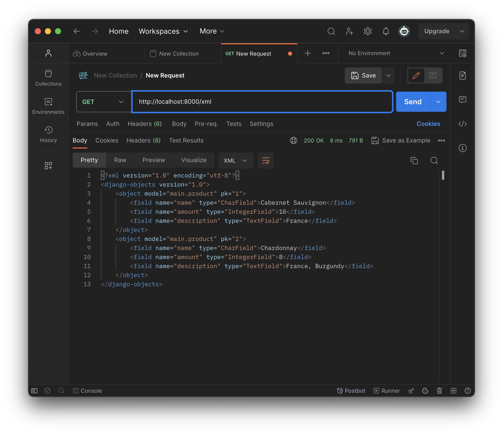

# Vineyard🍷

Nama    : Fariska Fedira Ardhanariswari

NPM     : 2206815705

Kelas   : PBP A

##Tugas 3
> Membuat input form untuk menambahkan objek model pada app sebelumnya.
   - Membuat sebuah berkas dengan nama forms.py untuk membuat struktur form sebagai input data produk baru pada aplikasi.
   - Lakukan impor ModelForm dari modul forms pada Django, ini digunakan untuk mempermudah proses pembuatan form untuk interaksi dengan data dalam Product.
   - Impor Product dari modul main.models, ini menunjukkan Product digunakan dalam form yang akan dibuat.
   - Definisikan kelas ProductForm yang merupakan turunan dari ModelForm.
   - Buat nested class, class Meta, untuk menentukan atribut yang akan digunakan.
   - Hubungkan form ProductForm dengan model Product, dengan menambahkan 'model = Product', form akan menggunakan definisi model Product sebagai dasar untuk membuat input fields.
   - Tambahkan 'fields = ["name", "amount", "description"]'. Fields digunakan untuk menentukan kolom dari form yang akan berisi field "nama", "amount", dan "description".
   - Pada berkas views.py tambahkan beberapa impor berikut:
      - from django.http import HttpResponseRedirect
      - from main.forms import ProductForm
      - from django.urls import reverse
   - Buat fungsi 'create_product' dengan parameter 'request', yaitu permintaan HTTP yang dikirim user ke server.
   - Tambahkan 'form = ProductForm(request.POST or None)' untuk membuat ProductForm baru dengan memasukkan QueryDict berdasarkan input user pada request.POST.
   - 'if form.is_valid() and request.method == "POST":', digunakan untuk memvalidasi isi input form dan *request* dikirimkan menggunakan metode POST.
   - 'form.save()' digunakan untuk membuat dan menyimpan data dari form tersebut.
   - 'return HttpResponseRedirect(reverse('main:show_main'))" untuk melakukan *redirect* setelah data form berhasil disimpan.
   - 'context = {'form': form}' dijalankan apabila input form tidak valid atau *request* tidak menggunakan POST, maka objek 'form' akan disertakan dalam 'context'.
   - 'return render(request, "create_product.html", context)', me-*render* halaman HTML.
   - Tambahkan 'Product.abjects.all()' pada fungsi show_main pada berkas 'views.py' untuk mengambil seluruh object Product yang tersimpan pada *database*.
   - Impor fungsi 'create_product' pada berkas 'urls.py'.
   - Tambahkan *path url* 'path('create-product', create_product, name='create_product'),' untuk mengakses fungsi yang sudah diimpor sebelumnya.
   - Buat berkas HTML dengan nama 'create_product.html' pada direktori 'main/templates'.
   - Pada berkas tersebut isi dengan '', untuk mengindikasikan template ini meng-*extend* dari 'base.html'.
   - '<form method="POST">' untuk menunjukkan data dari form dikirim dengan metode POST.
   - '' token di-*generate* secara otomatis dari Django yang berfungsi sebagai *security*.
   - '{{ form.as_table }}' untuk menampilakan *fields* form yang sudah dibuat sebagai *table*.
   - '<input type="submit" value="Add Product"/>' sebagai tombol *submit* untuk mengirimkan *request* ke *view*.
   - Pada main.html tambahkan komponen-komponen lain yang ingin ditambahkan dan sertakan tombol 'Add New product' yang akan 'redirect' ke halaman form.
> Tambahkan 5 fungsi views untuk melihat objek yang sudah ditambahkan dalam format HTML, XML, JSON, XML by ID, dan JSON by ID.
   - Format HTML
      - 

   - Format XML
      - Pada berkas views.py, impor HttpResponse dan Serializer.
      - Buat sebuah fungsi 'show_xml' dengan parameter *request*.
      - Simpan 'data = Product.objects.all()' pada sebuah variabel sebagai tempat menyimpan hasil *query* dari data yang ada pada 'Product'.
      - Tambahkan 'return HttpResponse(serializers.serialize("xml", data), content_type="application/xml")' sebagai *return function* berupa 'HttpResponse' dengan parameter data hasil *query* yang sudah diserialisasi menjadi XML.
      - Impor fungsi 'show_xml' pada berkas 'urls.py'.
       - Tambahkan *path url* 'path('xml/', show_xml, name='show_xml'),' untuk mengakses fungsi yang sudah diimpor sebelumnya.

   - Format JSON
      - Lakukan hal yang sama seperti pada format xml, namun diubah dengan json.
      - Buat fungsi 'show_json' yang diisi dengan 'data = Product.objects.all()' lalu me-*return* 'return HttpResponse(serializers.serialize("json", data), content_type="application/json")'
      - Impor fungsi 'show_json' pada berkas 'urls.py'.
       - Tambahkan *path url* 'path('json/', show_json, name='show_json'),' untuk mengakses fungsi yang sudah diimpor sebelumnya.

   - Format XML by ID
      - Lakukan hal yang sama seperti pada format xml, namun ubah variabel data dengan 'data = Product.objects.filter(pk=id)' untuk memberi filter menggunakan ID.
      - Buat fungsi 'show_xml_by_id' yang diisi dengan 'data = Product.objects.filter(pk=id)' lalu me-*return* 'return HttpResponse(serializers.serialize("xml", data), content_type="application/xml")'
      - Impor fungsi 'show_xml_by_id' pada berkas 'urls.py'.
       - Tambahkan *path url* 'path('xml/<int:id>/', show_xml_by_id, name='show_xml_by_id'),' untuk mengakses fungsi yang sudah diimpor sebelumnya.
      
   - Format XML by ID
      - Lakukan hal yang sama seperti pada format xml, namun diubah dengan json.
      - Buat fungsi 'show_json_by_id' yang diisi dengan 'data = Product.objects.filter(pk=id)' lalu me-*return* 'return HttpResponse(serializers.serialize("json", data), content_type="application/json")'
      - Impor fungsi 'show_json_by_id' pada berkas 'urls.py'.
      - Tambahkan *path url* 'path('json/<int:id>/', show_json_by_id, name='show_json_by_id'),' untuk mengakses fungsi yang sudah diimpor sebelumnya.

> Membuat routing URL untuk masing-masing views yang telah ditambahkan pada poin 2.
   - Untuk setiap fungsi format pada poin 2, impor fungsi pada berkas 'urls.py', kemudian tambahkan *path url* dengan format dibawah ini:
      - 'path('xml/', show_xml, name='show_xml'),'
      - 'path('json/', show_json, name='show_json'),'
      - 'path('xml/<int:id>/', show_xml_by_id, name='show_xml_by_id'),'
      - 'path('json/<int:id>/', show_json_by_id, name='show_json_by_id')'

> Apa perbedaan antara form POST dan form GET dalam Django?
   - POST
      - Method POST akan mnegirim data/nilai langsung ke action untuk disimpan, tanpa menampilkannya pada url.
      - Data yang dikirim tidak memiliki batas.

   - GET
      - Method GET akan menampilkan data/nilai pada url, kemudian ditampung oleh action.
      - Data tidak boleh lebih dari 2047 karakter.

> Apa perbedaan utama antara XML, JSON, dan HTML dalam konteks pengiriman data?
   - XML
      - Digunakan untuk menyimpan dan mengirim data terstruktur, seperti konfigurasi dan pertukaran data antar aplikasi.
      - Memiliki struktur yang fleksibel dan dapat mendefinisikan tipe data yang kompleks, menggunakan tag.
      - Memiliki ukuran file yang lebih besar karena *markup* lebih banyak.

   - JSON
      - Digunakan untuk pertukaran data antara aplikasi web dan server.
      - Terdiri dari pasangan key-value dalam format objek dan array.
      - Ukuran file lebih kecil karena formatnya ringkas.
   
   - HTML
      - Digunakan untuk membuat halaman web dan menampilkan konten di browser web.
      - Digunakan untuk mengatur tampilan dan konten halaman web, presentasi dan interaksi pengguna.
      - Ukuran file tergantung kompleksitas halaman web.

> Mengapa JSON sering digunakan dalam pertukaran data antara aplikasi web modern?
   - Format JSON ringkas dan mudah dibaca.
   - Ukuran file JSON kecil, mengurangi beban jaringan.
   - JSON didukung dengan banyak bahasa pemrograman, sehingga mudah digunakan diberbagai platform.
   - Struktur data yang terurut, dapat menggambarkan data kompleks dengan objek dan array.
   - Didukung oleh browser web modern melalui JavaScript. 

> Mengakses kelima URL di poin 2 menggunakan Postman, membuat screenshot dari hasil akses URL pada Postman, dan menambahkannya ke dalam README.md.

##Tugas 2
> Membuat sebuah proyek Django baru.
   - Membuat direktori sebagai tempat menyimpan proyek Git dan membuat repositori baru untuk mengelola proyek sesuai ketentuan dan diberi nama sesuai keinginan.
   - Menghubungkan repositori lokal dengan repositori pada GitHub.
   - Membuat virtual environment dengan menjalankan perintah "python -m venv env" pada terminal.
   - Aktifkan virtual environment dengan menjalankan perintah "source env/bin/activate", virtual environment digunakan untuk mengisolasi package serta dependencies dari aplikasi sehingga tidak bertabrakan dengan versi lain yang ada pada komputer. Aktifnya virtual environment ditandai dengan "(env)" di barus input pada terminal.
   - Menyiapkan dependencies sesuai ketentuan dengan nama file requirement.txt. Dependencies adalah komponen/modul yang dibutuhkan oleh suatu perangkat lunak untuk bekerja.
   - Pasang dependencies dengan menjalankan perintah "pip install -r requirements.txt"
   - Membuat proyek Django dengan nama "vineyard" dengan menjalankan perintah "django-admin startproject vineyard ."
   - Mengonfigurasi proyek dan menjalankan server dengan menambahkan "*" pada ALLOWED_HOSTS di settings.py untuk memberi akses pada semua host.
   - Memastikan berkas manage.py aktif dengan menjalankan server Django dengan perintah "python manage.py runserver" kemudian cek pada peramban web "http://localhost:8000" untuk mengetahui aplikasi yang dibuat berhasil.

> Membuat aplikasi dengan nama main pada proyek tersebut.
   - Aktifkan virtual environment yang telah dibuat sesuai perintah di atas.
   - Buat aplikasi baru bernama main dengan menjalankan perintah "python manage.py startapp main" untuk memberi struktur awal dan aplikasi tersebut.

> Melakukan routing pada proyek agar dapat menjalankan aplikasi main.
   - Daftarkan aplikasi main tersebut ke dalam proyek dengan menambahkan "main" pada variabel INSTALLED-APPS di berkas settings.py

> Membuat model pada aplikasi main dengan nama Item dan memiliki atribut wajib sebagai berikut.
    - Mengubah berkas models.py untuk mendefinisikan model yang baru.
    - Impor modul models dari django.db sebagai modul untuk membantu mendefinisikan model basis data untuk aplikasi.
    - Sertakan class Product (models.Model) sebagai kelas dasar untuk mendefinisikan model dalam Django.
    - Isi berkas models.py dengan atribut dan definisikan dengan tipe data yang sesuai seperti name dengan tipe CharField, amount dengan tipe IntegerField, dan description dengan tipe TextField.
    - Lakukan migrasi model untuk melihat perubahan pada model basis data yang didefinisikan. Buat migrasi model dengan menjalankan perintah "python manage.py makemigrations".
    - Aplikasikan perubahan model dengan perintah "python manage.py migrate".

>  Membuat sebuah fungsi pada views.py untuk dikembalikan ke dalam sebuah template HTML yang menampilkan nama aplikasi serta nama dan kelas kamu.
   - Impor render dari django.shortcuts untuk me-render tampilan HTML sesuai dengan data yang diberikan.
   - Membuat fungsi show_main dengan parameter request untuk mengatur permintaan HTTP dan mengembalikan tampilan yang sesuai.
   - Melengkapi "context" pada fungsi show_main yaitu dictionary yang berisi data untuk ditampilkan.
   - Fungsi show_main menggunakan return render(request, "main.html", context) untuk me-render tampilan main.html dengan menggunakan fungsi render.

> Membuat sebuah routing pada urls.py aplikasi main untuk memetakan fungsi yang telah dibuat pada views.py.
   - Melakukan routing pada proyek agar aplikasi main dapat diakses melalui peramban web.
   - Membuat berkas urls.py di dalam direktiri main untuk mengatur rute URL yang terkait dengan aplikasi main.
   - Melakukan impor path dari django.urls untuk mendefinisikan pola URL dan menggunakan fungsi show_main dari modul main.views sebagai tampilan ketika URL diakses.
   - Mengonfigurasi routing URL proyek dengan mengimpor fungsi include dari django.urls untuk mengimpor rute URL dari aplikasi main ke dalam berkas urls.py.
   - Tambahkan path URL "main/" untuk mengarahkan rute pada aplikasi main.

> Melakukan deployment ke Adaptable terhadap aplikasi yang sudah dibuat sehingga nantinya dapat diakses oleh teman-temanmu melalui Internet.
   - Login Adaptable dengan menggunakan akun GitHub.
   - Sambungkan GitHub dengan repositori yang ingin di-deploy.
   - Tekan tombol New App -> Connect an Existing Repository -> pilih proyek "Vineyard" sebagai basis aplikasi yang ingin di-deploy.
   - Pilih Python App Template sebagai template deployment dan PostgreSQL sebagai tipe basis data yang akan digunakan.
   - Sesuaikan versi Python yang digunakan.
   - Untuk bagian Start Command isi dengan perintah "python manage.py migrate && gunicorn vineyard.wsgi".
   - Isi nama aplikasi dengan "vineyard".
   - Centang bagian HTTP Listener on PORT lalu klik Deploy App.

> Buatlah bagan yang berisi request client ke web aplikasi berbasis Django beserta responnya dan jelaskan pada bagan tersebut kaitan antara urls.py, views.py, models.py, dan berkas html.
   - User mengirimkan request ke URL, kemudian berkas urls.py akan mencocokan permintaan user dengan pola URL yang sesuai dan mengarahkan ke views sesuai berkas views.py. Views akan menggunakan Model dalam berkas models.py untuk mengakses data yang diperlukan. Views akan me-render halaman HTML dengan template yang sesuai kemudian menggabungkan dengan data dari model ke halaman web. Halaman web akan dikirim kembali sebagai respon kepada user.
   

> Jelaskan mengapa kita menggunakan virtual environment? Apakah kita tetap dapat membuat aplikasi web berbasis Django tanpa menggunakan virtual environment?
   - Kita tetap sapat membuat aplikasi web berbasis Django tanpa menggunakan virtual environment, tetapi tidak disarankan. Jika tidak menggunakan virtual environment terdapat risiko konflik dependencies. Virtual environment berguna untuk mengisolasi package serta dependencies dari aplikasi sehingga tidak bertabrakan dengan versi lain pada perangkat user.

> Jelaskan apakah itu MVC, MVT, MVVM dan perbedaan dari ketiganya.
   - MVC : Model View Controller
        - Model : Tempat menyimpan data dan informasi aplikasi.
        - View : Tampilan, menunjukkan informasi kepada pengguna. Seperti halaman web pengguna aplikasi.
        - Controller : Mengatur bagaimana permintaan pengguna ditangani. Penghubung antara View dan Model.
        Perbedaan : Cara mengorganisir kode dalam aplikasi agar mudah dimengerti, biasa digunakan dalam aplikasi berbasis desktop dan web.
   - MVT : Model View Template
        - Model : Tempat menyimpan data dan informasi aplikasi seperti pada MVC.
        - View : Tampilan yang menampilkan informasi kepada pengguna.
        - Template : Mengatur tampilan halaman web dan menentukan bagaimana data dari Model akan ditampilkan.
        Perbedaan : Varian dari MVC yang digunakan dalam kerangka Django, Template mengatur tampilan dalam halaman web dan menggabungkan dengan data dari Model.
   - MVVM : Model View ViewModel
        - Model : Tempat menyimpan data dan informasi aplikasi.
        - View : Tampilan yang menampilkan informasi kepada pengguna.
        - ViewModel : Penghubung antara Model dan View, mengelola tampilan data dari Model, dan menyediakan cara untuk berinteraksi dengan data tersebut.
        Perbedaan : ViewModel memisahkan cara data ditampilan dari data itu sendiri.